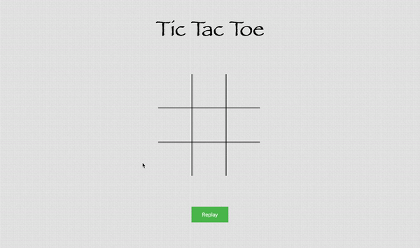

# Unbeatable Tic Tac Toe

An unbeatable Tic Tac Toe game powered by the **Minimax algorithm** — designed to **never lose**. Built entirely using **vanilla JavaScript, HTML, and CSS**, this project demonstrates the power of recursion and decision trees in game strategy.

---

## Features

-  AI opponent that uses the Minimax algorithm to make optimal moves
-  Intuitive 3x3 game grid interface
-  Instant win/draw/loss detection and display
-  Clean, minimal styling with responsive layout
-  Runs entirely in the browser – no backend required

---

##  Technologies Used

- **JavaScript** – Game logic + AI (Minimax)
- **HTML** – Structure and layout
- **CSS** – Styling and animation

---

##  Demo



---

## 🔗 Live Version

> Currently not deployed.  
You can host it using **GitHub Pages** or any static site service like Netlify.

To deploy via GitHub Pages:
1. Go to your repository's Settings → Pages
2. Select branch: `main` and folder: `/root`
3. Click "Save" — your site will go live at:  
   `https://abhav04.github.io/unbeatable-tic-tac-toe/`

---

##  How It Works

The AI uses the **Minimax algorithm**, which recursively evaluates all possible game states to choose the optimal move. It guarantees a draw or a win — never a loss.

> This makes it impossible for a human player to beat the AI.

---

##  Getting Started

To run locally:

```bash
git clone https://github.com/Abhav04/unbeatable-tic-tac-toe.git
cd unbeatable-tic-tac-toe
open index.html   # or just double-click index.html
